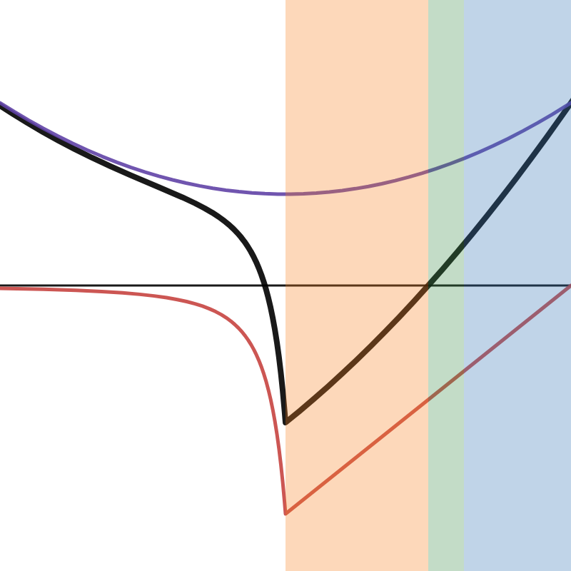

# Poseidon

[Hestia](./Hestia.md) is the exterior surface of this planet, and Poseidon is the core.

Poseidon is a world entirely made of water. It's not that it's a water world with no islands, it's that there is no surface to the water — when you swim up, there is a force that increases in strength that pushes you back down.

It's a modification/interpretation of 5e's Elemental Plane of Water.

## Physics

There are two forces on anyone in Poseidon, gravity and the Weave. Consider a frame where you're standing on the surface of Poseidon, where Hestia is below you and the sun is above.

Gravity points upwards. It decreases linearly with height. The boundary conditions are Hestia's true gravity at the boundary between the worlds and close to 0 at the sun.

The Weave points downwards. Its magnitude increases approximately quadratically with height (not actually quadratically because of the difference in magic charge between the sun and the Gliss — but approaches quadratic closer and closer to the sun).

There is a considerable layer of mantle between Hestia and Poseidon's surface (the [Underdark](./Underdark.md)), and the Gliss and sun are set up such that the equi-magic-potential is at Hestia's surface, not Poseidon's. Therefore Hestia's surface is where the magic force is at its weakest, and it's stronger at Poseidon's surface. Similarly, gravity is weaker at Poseidon's surface (due to the linear dropoff), and strongest at Hestia's.

[Desmos graph](https://www.desmos.com/calculator/po5ucvvqh4)

The blue region is Poseidon, the green is the Darkened Depths, the orange the Underdark, and the white Hestia. The purple line is the Weave, the red line is gravity, and the black line is the total force. Positive means force pointed radially outwards.

## General notes

(inspired by [this video](https://youtu.be/ksAu3OHMZzo) and [this video](https://youtu.be/5U-PYEMReI0))

- The Gliss / Poseidon's sun is a "Plane of Water vortex"
  - Mostly useful for me
- The "Darkened Depths" (Plane of Ooze / Swamp of Oblivion) before the Underdark
  - This is a place the Marids cannot go, but the Shabah can — so the revelers may have to be guided by Shabah
- Towards the Plane of (Ice, Salt, Steam), water becomes (cold, brackish, hot)
- The "Citadel of Ten Thousand Pearls" ("the Citadel" for short) is the colony (coral city-state) the revelers find
  - Designed around a series of natural currents
  - Several dozen miles wide
  - Domed, curved buildings (more like shells than domes, spirally rather than spherical)
  - Big glowing pearls light the city
- People: Marids, "Shabah" (water elementals) (what about sahuagin, triton, merfolk, and locathah? — maybe those are from Hestia)
  - Marids and Shabah live almost parallel to each other
  - They are fundamentally very different, and do not share a language or most biological needs
  - The party will initially interface with the Marid part of the colony
- Creatures/monsters: Mephits (ice and steam, closer to respective planes), "Safarat" (sea hags), Aboleths
  - Mephits are very rare near the Citadel, not a big deal
  - Safarat are dangerous because they disguise themselves as Marids and sneak into the Citadel and then attack people
    - Unknown what they want or how intelligent they are
  - Aboleths are very rare, like dragons
    - Not mythical, but most Marids have never seen one
  - General big fish also exist, closer to the Darkened Depths (which has less gravity)
- "red tides" are currents that carry parasites
- "burn water" are acidic patches of water
- Plenty of names to draw from, the gods of the plane, also a few water elemental names

The big cosmological thing is that magic is very rare on Poseidon (see the explanation on the [Gliss](./Gliss.md) page). But, those who have the potential for magic are on average more powerful than Hestians who choose to pursue magic. Also, those from the Darkened Depths are more likely to have the potential (because the local Weave is weaker).

Ideas from brainstorming session with Chris:

- Would be cool to have a single [Nightwalker](https://forgottenrealms.fandom.com/wiki/Nightwalker) in the Darkened Depths with an interesting backstory
- The [Stormrider's Pearl](https://forgottenrealms.fandom.com/wiki/Storm_rider%27s_pearl), needed to traverse the Darkened Depths via a ship modification
  - Developed to control the currents for irrigation or similar, and has the side effect of controlling the Shabah, which the higher-ups will advertise as an added bonus (but don't think too hard about it)
  - One key could be working with the translator person to give the Shabah voices, which would very quickly make the issue with the Pearl evident and would put the public against its use
  - This isn't a necessary path, because they could always just steal the Pearl
- Maybe the people in power are the people who have magic
- Something foreboding in the Underdark that hints at the reason for the Gliss/sun setup (Illithids?) (approximately Chris's idea: the Illithids are aliens who came to conquer, ancient Hestians summoned the gods who banished them to the Underdark. The Gliss was the result of summoning the gods.)

## History

(fill in)

## The Marids and the Shabah

(fill in)
